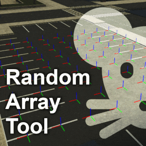
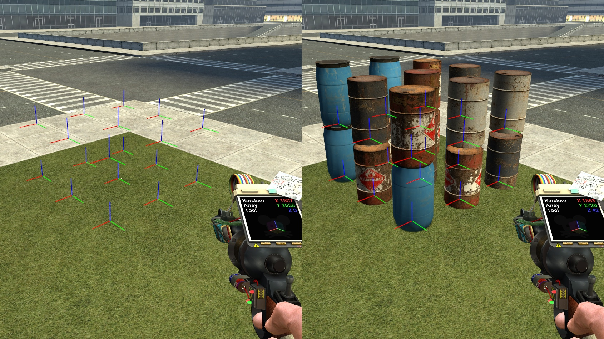
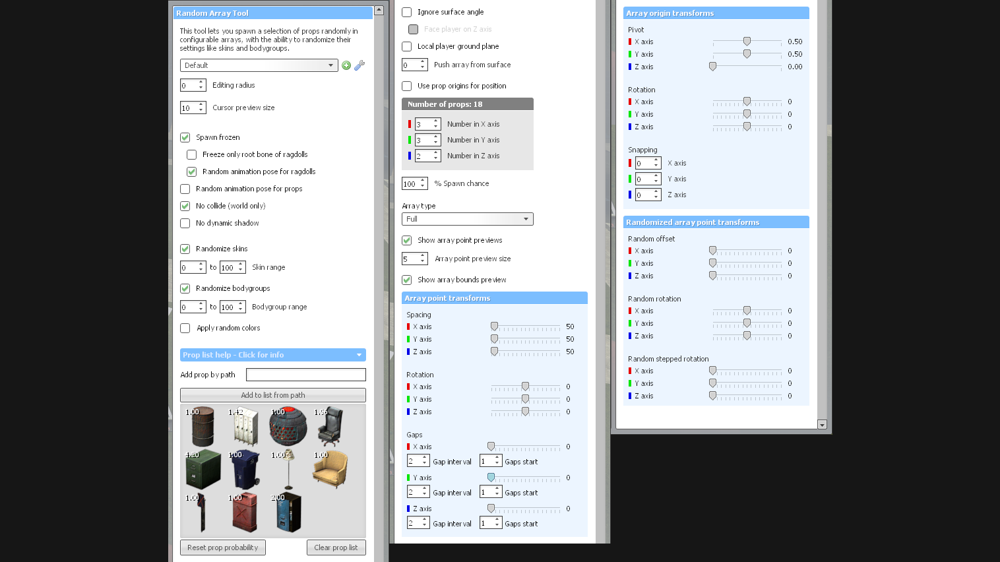

## Random Array Tool

A tool for spawning a selection of props randomly in configurable arrays, with the ability to randomize their settings like skins and bodygroups. It also has the ability to randomize already spawned props.

Available at the [Garry's Mod Workshop.](https://steamcommunity.com/sharedfiles/filedetails/?id=2384188626)

